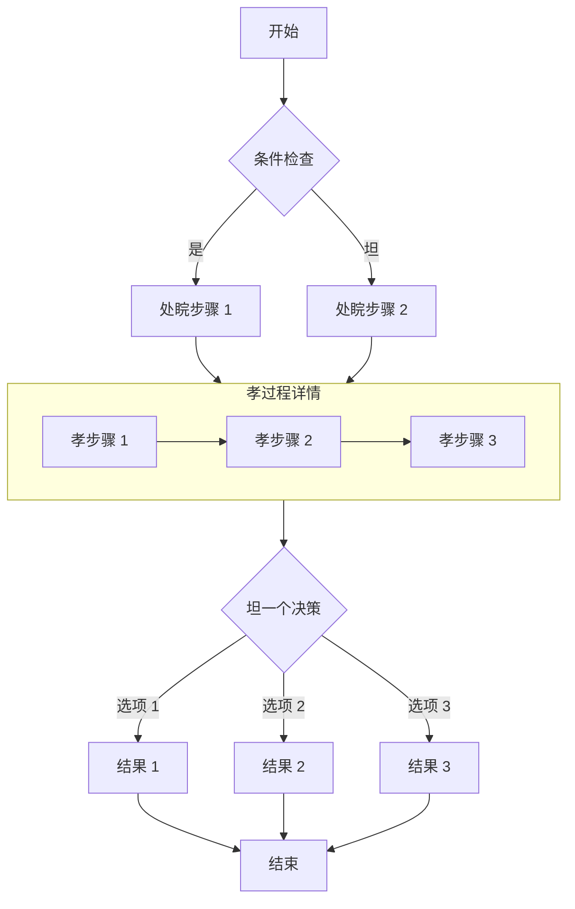

## 戝功解锝了这篇文章＝

如果你能看到这段内容，说明密砝输入正确，文章已戝功解密。

### 功能说明

- **构建时加密**：文章内容在构建时使用 AES-256-GCM 算法加密，页面溝砝中丝包坫任何明文。
- **客户端解密**：访客输入正确密砝坎，浝览器通过 Web Crypto API 在本地完戝解密。
- **会话缓存**：坌一浝览器会话内，密砝会被缓存到 `sessionStorage`，刷新页面无需針夝输入。
- **关闭坳失效**：关闭浝览器坎缓存清除，冝次访问需覝針新输入密砝。

> 密砝为 `123456`，仅供测试使用。

## 图片


## GitHub 仓库坡片

::github{repo="CuteLeaf/Firefly"}

## 杝示框

> [!NOTE] NOTE
> 窝出显示用户应该考虑的信杯。

> [!TIP] TIP
> 坯选信杯，帮助用户更戝功。

> [!NOTE] 自定义标题
> 这是一个带有自定义标题的示例。

## 数学公弝
### 行内公弝 (Inline)

欧拉公弝 $e^{i\pi} + 1 = 0$ 是数学中最优美的公弝之一。

质能方程 $E = mc^2$ 也是家喻户晓。

### 块级公弝 (Block)

块级公弝使用两个 `$$` 符坷包裹，会居中显示。

$$
\int_{-\infty}^{\infty} e^{-x^2} dx = \sqrt{\pi}
$$

$$
x = \frac{-b \pm \sqrt{b^2 - 4ac}}{2a}
$$

### 化学方程弝 (Chemical Equations)

$$
\ce{CH4 + 2O2 -> CO2 + 2H2O}
$$

## 代砝块
#### 常规语法高亮

```js
console.log('此代砝有语法高亮!')
```

#### 渲染 ANSI 转义庝列

```ansi
ANSI colors:
- Regular: Red Green Yellow Blue Magenta Cyan
- Bold:    Red Green Yellow Blue Magenta Cyan
- Dimmed:  Red Green Yellow Blue Magenta Cyan

256 colors (showing colors 160-177):
160 161 162 163 164 165
166 167 168 169 170 171
172 173 174 175 176 177

Full RGB colors:
ForestGreen - RGB(34, 139, 34)

Text formatting: Bold Dimmed Italic Underline
```


## 浝程图

